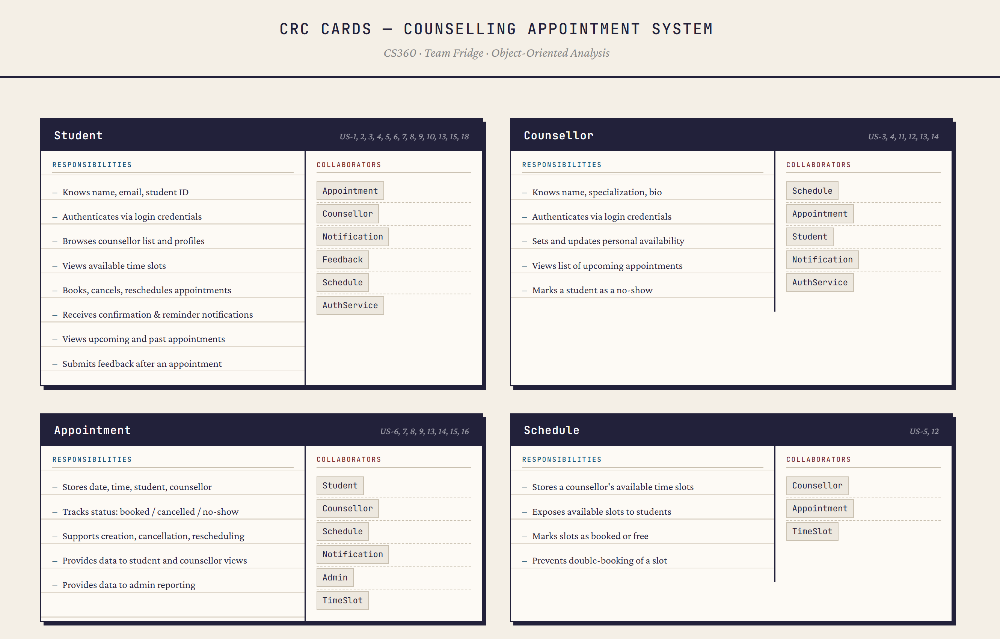
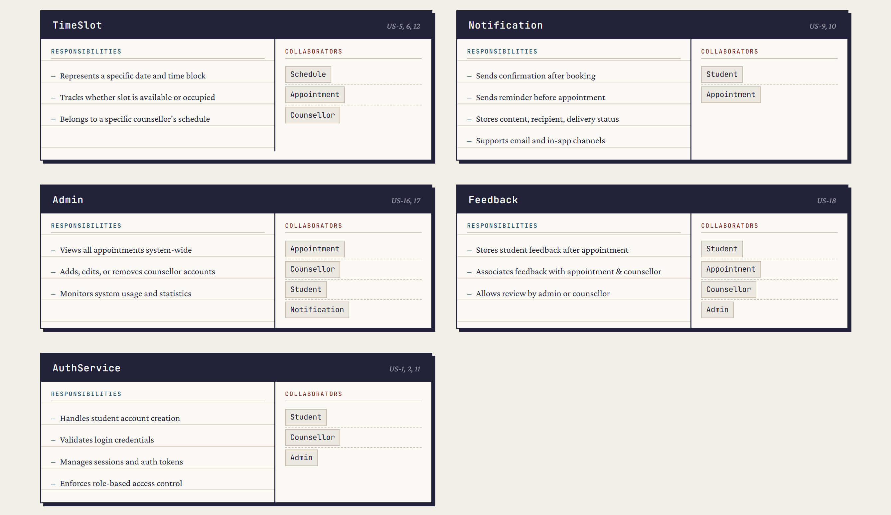

# Counseling Appointment System

**Group:** Fridge | **Group Number:** 30 | **Course:** CS360

## Quick Links

- [Project Backlog](https://github.com/orgs/CS360S26fridge/projects/1/views/1?verticalGroupedBy%5BcolumnId%5D=Status)
- [Figma Wireframes](https://www.figma.com/design/4fzggh6GxJXPUFlywXCYmJ/FINAL-UI?node-id=0-1&p=f&t=LWpNH0ZXlM9t9m6A-0)
- [Figma Prototype](https://www.figma.com/proto/4fzggh6GxJXPUFlywXCYmJ/FINAL-UI?node-id=2-2&p=f&t=LWpNH0ZXlM9t9m6A-0&scaling=min-zoom&content-scaling=fixed&page-id=0%3A1&starting-point-node-id=2%3A2)
- [Storyboard](https://github.com/CS360S26fridge/fridge-project/blob/main/doc/storyboard.md)
- [Meeting Minutes & Sprint Documentation](https://github.com/CS360S26fridge/fridge-project/blob/main/PROJECT_DOCUMENTATION.md)

---

## Team Information

| Name | Roll Number | GitHub Username |
|------|-------------|-----------------|
| Saman Bahzad Khan | 27100111 | [@SamanBahzadKhan](https://github.com/SamanBahzadKhan) |
| Ishal Rahat | 27100335 | [@ishal27100335](https://github.com/ishal27100335) |
| Husnain Khattak | 27100351 | [@panda-wav](https://github.com/panda-wav) |
| Owais Amir | 27100429 | [@owais-amir-27](https://github.com/owais-amir-27) |
| Aurangzaib | 26100345 | [@Aurangzaib-gill](https://github.com/Aurangzaib-gill) |

**TA:** Muhammad Mustafa — Roll No. 26100038

---

## Project Overview

**Project Name:** Counseling Appointment System
**Course:** CS360
**Group Name:** Fridge
**Group Number:** 30

**Concept:** An appointment management platform that connects students with counseling services, enabling easy booking, scheduling, and session management.

**Primary Users:** Students, Counselors, Counseling Office Administrators

**Key Challenges:** Privacy and confidentiality, scheduling conflict management, reliable notification system, no-show prevention

---

## Repository Structure

```
project-repository/

README.md
PROJECT_DOCUMENTATION.md

docs/
   UMLFINAL.png
   storyboard.md
   team.txt

app/

crc-cards/
   c1.png
   c2.png

UI_Mockups/
   ptype.png
   mockups.png
```

---

## Repository Setup

**Visibility:** Private
**Collaborators with Read Access:**

| GitHub Account | Role |
|----------------|------|
| [@Negatrin](https://github.com/Negatrin) | Assigned TA |
| [@abdulali](https://github.com/abdulali) | Course Instructor |
| [@sulemanshahid](https://github.com/sulemanshahid) | Course Instructor |
| [@SafaSalam](https://github.com/SafaSalam) | Safa |

---

## Phase Deliverables

### Phase 1 — Core Features

Initial scope definition and project setup.

**User Stories:**
- Counselor discovery and availability viewing
- Time slot booking system
- Appointment reminders and notifications
- Rescheduling and cancellation functionality
- Counselor availability management dashboard

---

### Phase 2 — Design & Architecture

#### 1. Product Backlog

The product backlog contains a list of user stories describing the functional requirements of the system. Each user story includes a User Story ID, story description, story points (effort estimation), risk level (Low / Medium / High), and halfway release indicator.

The backlog is maintained using **GitHub Issues**: https://github.com/orgs/CS360S26fridge/projects/1

#### 2. CRC Cards

CRC (Class–Responsibility–Collaborator) cards identify the key classes in the system, their responsibilities, and the classes they interact with.

Location: `crc-cards/`




Classes identified: Student, Counselor, Appointment, Schedule, TimeSlot, Notification, Admin, Feedback, Authentication Service

#### 3. UI Mockups

Location: `UI_Mockups/`


Screens included: Splash Screen, Login Screen, Student Dashboard, Counselor Dashboard, Appointment Booking Screen, Appointment Confirmation Screen, Appointment History Screen, Notification Screen, Student Profile Screen, Counselor Profile Screen, Edit Profile Screen, Admin Dashboard, Admin Login Screen, Feedback Screen, Leave Feedback Screen, Counselor Sign Up Screen, Student Sign Up Screen, Counselor Appointments Screen, Student Journal Screen, Session Notes Screen

#### 4. Storyboards

Location: `docs/storyboard.md`

Scenarios covered:
1. Authentication / Login
2. Student Books Appointment
3. Student Cancels or Reschedules Appointment
4. Counselor Manages Availability

#### 5. UML Class Diagram

Location: `doc/UMLFINAL.png`


The system follows an MVC-inspired structure:

- **Views (Activities & Fragments)** — Handle user interaction and UI rendering (e.g., BookAppointmentActivity, StudentDashboardActivity)
- **Controllers** — Contain business logic and coordinate between UI and data layers (e.g., AppointmentController, NotificationController, AuthController)
- **Models** — Represent core data entities (e.g., Appointment, TimeSlot, Student, Counselor, Notification)
- **Workers** — Handle background tasks such as reminders (e.g., ReminderWorker)
- **Utilities** — Provide helper functions for common operations (e.g., DateUtils, NotificationUtils)

Firebase is used as the backend for storing application data.

---

### Phase 3 — Halfway Prototype

Following TA feedback from Phase 2, the entire UI was redesigned and revamped to better align with usability and visual consistency standards. The prototype was then built to cover approximately half the planned requirements, corresponding to the halfway release checkpoint marked in the product backlog.

Sprint planning and review records for this phase are documented in `PROJECT_DOCUMENTATION.md`.

**Progress against backlog:** See the GitHub Projects board for which user stories were marked complete at this checkpoint.

---

### Phase 4 — Final Prototype

The complete, release-ready application covering all planned requirements.

#### What Was Built

- **Full appointment booking flow** — Students can discover counselors, view availability, book, reschedule, and cancel appointments.
- **Counselor availability management** — Counselors can manage their schedules through a dedicated dashboard.
- **Notifications and reminders** — Appointment reminders are sent via a background worker.
- **No-show tracking and analytics** — Tracked in the admin dashboard.
- **Post-session feedback** — Students can leave feedback after a completed session.
- **Appointment history** — Available to both students and counselors.

#### Design Decisions

Several significant design decisions were made during this phase based on TA feedback and evolving requirements:

**Admin-controlled counselor onboarding:** Counselors can no longer self-register through the app. Only students can sign up directly. Counselor accounts must be created and approved by an administrator. This ensures that only verified, legitimate counselors are accessible to students.

**AI-powered counselor recommendation chatbot:** An LLM-based chatbot was integrated into the student-facing side of the app. Students can describe their needs or concerns, and the chatbot recommends the most suitable counselor for them based on the available counselor profiles. This helps students who are unsure which counselor to approach.

**Student daily journal:** Students have access to a private journaling feature within the app. This allows them to log their thoughts and track their mental well-being between sessions, entirely separate from the counselor's view.

**Session notes by counselors:** At the end of a session, counselors can add structured notes. These notes are then made visible to the student on their dashboard, giving students a reference point for what was discussed and any follow-up actions.

**Report to Admin:** Students and counselors can submit reports about users (counselors or students respectively). Administrators can review these reports and choose to either remove the reported user from the platform or dismiss the report.

---

## Project Backlog

The backlog is maintained using the **GitHub Projects** tab. See the board linked at the top for the full, up-to-date list of features, task assignments, and completion status across all phases.

### Phase 1 — Core (Completed)
- [x] Counselor discovery and availability viewing
- [x] Time slot booking system
- [x] Appointment reminders and notifications
- [x] Rescheduling and cancellation functionality
- [x] Counselor availability management dashboard

### Phase 2 — Progressive (Completed)
- [x] No-show tracking and analytics
- [x] Pre-session intake forms
- [x] Post-session feedback mechanism
- [x] Appointment history for students and counselors

### Phase 4 Additions (Completed)
- [x] AI counselor recommendation chatbot
- [x] Student daily journal
- [x] Counselor session notes (visible to student)
- [x] Admin-only counselor approval flow
- [x] Report to Admin with admin moderation panel
