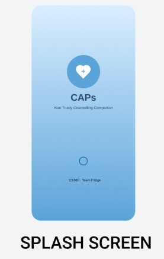
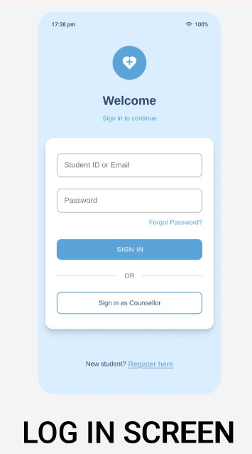
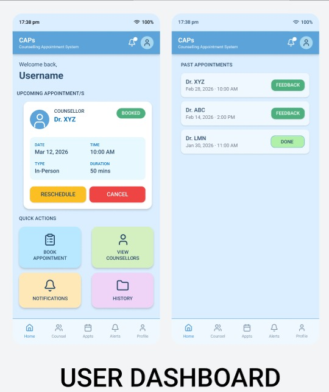
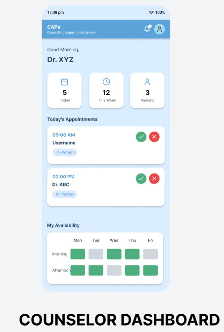
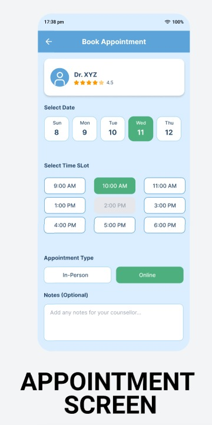
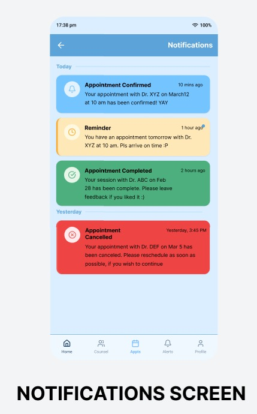
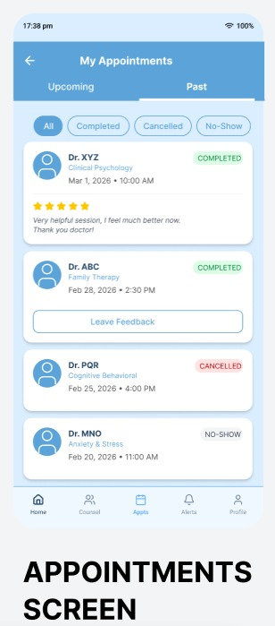

# Storyboards – Counseling Appointment System (CAPS)

This document describes the primary user interaction scenarios for the Counseling Appointment System (CAPS).
Each storyboard illustrates how users interact with the system to accomplish common tasks such as authentication, booking appointments, modifying appointments, and managing counselor availability.

---

# 1. Storyboard: Authentication / Login

**Scenario:**
A user (student or counselor) logs into the CAPS platform to access system features.

---

### Step 1 — Open Application

* **Screen:** 

 
* **User Action:** The user launches the CAPS application.
* **System Response:** The system displays the splash screen while loading the application.

---

### Step 2 — Navigate to Login Screen

* **Screen:**

  
* **User Action:** The user is presented with the login interface.
* **System Response:** The system displays input fields for email/username and password.

---

### Step 3 — Enter Credentials

* **Screen:** 

* **User Action:** The user enters their email/username and password.
* **System Response:** The system waits for the user to submit the login form.

---

### Step 4 — Submit Login Request

* **Screen:** 
* **User Action:** The user clicks the **Login** button.
* **System Response:** The system verifies the credentials using the authentication service.

---

### Step 5 — Redirect to Dashboard

* **Screen:** 

  
* **System Response:**

  * If credentials are valid, the user is redirected to their dashboard.
  * If credentials are invalid, an error message is displayed.

---

# 2. Storyboard: Student Books an Appointment

**Scenario:**
A student schedules a counseling session with an available counselor.

---

### Step 1 — Access Student Dashboard

* **Screen:** 

  
* **User Action:** The student logs in and views the dashboard.
* **System Response:** The system displays available actions such as viewing counselors and appointments.

---

### Step 2 — Browse Available Counselors

* **Screen:** 

* **User Action:** The student browses the list of available counselors.
* **System Response:** The system displays counselor profiles and availability information.

---

### Step 3 — Select Appointment Slot

* **Screen:** 

* **User Action:** The student chooses a preferred date and available time slot.
* **System Response:** The system checks whether the selected slot is available.

---

### Step 4 — Confirm Appointment Booking

* **Screen:** 

* **User Action:** The student confirms the booking.
* **System Response:** The system creates the appointment record.

---

### Step 5 — Receive Confirmation Notification

* **Screen:** 

* **System Response:**
  The system sends a confirmation notification to the student and updates the counselor’s schedule.

---

# 3. Storyboard: Student Cancels or Reschedules an Appointment

**Scenario:**
A student modifies an existing counseling appointment by canceling or rescheduling it.

---

### Step 1 — Open Student Dashboard

* **Screen:** 

* **User Action:** The student navigates to their dashboard.
* **System Response:** The system displays the student’s appointment options.

---

### Step 2 — View Appointment History

* **Screen:** 

* **User Action:** The student opens the appointment history section.
* **System Response:** The system displays a list of current and past appointments.

---

### Step 3 — Select Appointment to Modify

* **Screen:** 

* **User Action:** The student selects the appointment they wish to modify.
* **System Response:** The system shows available options such as cancel or reschedule.

---

### Step 4 — Cancel or Reschedule Appointment

* **Screen:** 

* **User Action:**

  * If canceling, the student confirms cancellation.
  * If rescheduling, the student selects a new time slot.
* **System Response:** The system updates the appointment accordingly.

---

### Step 5 — System Sends Update Notification

* **Screen:** 
* **System Response:**
  The system notifies the student and counselor about the updated appointment status.

---

# 4. Storyboard: Counselor Manages Availability

**Scenario:**
A counselor updates their availability schedule so students can book appointments.

---

### Step 1 — Counselor Login

* **Screen:** 
* **User Action:** The counselor logs into the CAPS system.
* **System Response:** The system verifies credentials and redirects to the counselor dashboard.

---

### Step 2 — Access Counselor Dashboard

* **Screen:** 

* **User Action:** The counselor opens the dashboard to manage appointments and schedules.
* **System Response:** The system displays the counselor’s current availability and appointments.

---

### Step 3 — Update Availability

* **Screen:** 

* **User Action:** The counselor adds, removes, or modifies available time slots.
* **System Response:** The system updates the availability schedule.

---

### Step 4 — Save Schedule Changes

* **Screen:** 

 

* **User Action:** The counselor saves the updated schedule.
* **System Response:** The system records the new availability.

---

### Step 5 — Updated Availability Visible to Students

* **Screen:** 

* **System Response:**
  Students can now view the updated availability when booking appointments.

---

# Mockup Screens Referenced

The following UI mockups are used in the storyboards:

Splash.png
Login.png
User.png
Counselor.png
Appointment.png
Appointment_hist.png
Notification.png
Profile.png
Admin.png
